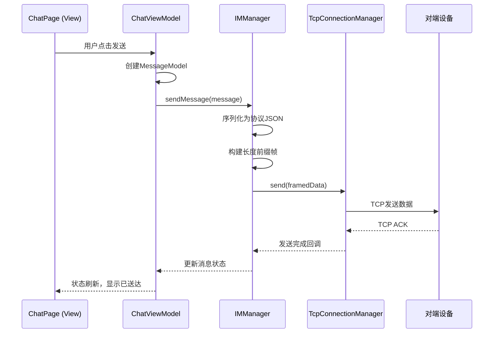
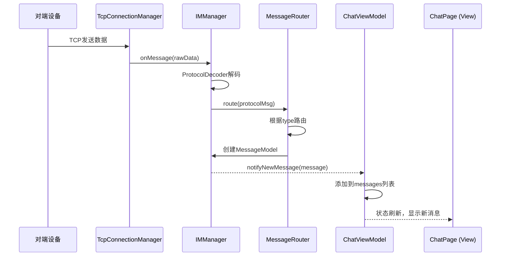

# 跨设备即时通信（IM）系统技术架构设计文档

## 文档信息

| 项目     | 内容                                           |
| -------- | ---------------------------------------------- |
| 文档名称 | 跨设备即时通信系统技术架构设计文档             |
| 文档版本 | V1.0                                           |
| 编制日期 | 2026-06-24                                     |
| 技术栈   | HarmonyOS NEXT (API 12+) + ArkTS + ArkUI       |
| 参考文档 | 《跨设备即时通信（IM）系统需求规格说明书》V1.0 |


## 一、文档概述

### 1.1 文档目的

本文档旨在为跨设备即时通信（IM）系统的开发提供完整的技术架构指导，涵盖：

- 系统整体架构设计与分层模型
- 各模块的详细设计与实现规范
- 核心通信机制的技术方案
- 数据持久化与状态管理方案
- 开发规范与质量标准

### 1.2 适用范围

本架构文档适用于所有参与本项目的开发人员、测试人员及技术决策者，作为开发、测试、部署的技术基准。

### 1.3 设计原则

| 原则         | 说明                                           |
| ------------ | ---------------------------------------------- |
| **分层解耦** | 采用三层工程架构，各层职责明确，依赖关系单向   |
| **MVVM模式** | UI与业务逻辑分离，提升可维护性与可测试性       |
| **模块化**   | 功能模块高内聚、低耦合，支持独立开发与按需组合 |
| **零依赖**   | 不依赖任何云服务、账号体系或外部网络基础设施   |
| **性能优先** | 针对Wi-Fi Direct特性优化，确保低延迟、高吞吐   |


## 二、整体架构设计

### 2.1 三层工程架构

基于HarmonyOS NEXT推荐的分层模块化设计理念，系统采用**产品定制层—基础特性层—公共能力层**的三层逻辑模型：

```
┌─────────────────────────────────────────────────────────────┐
│                    产品定制层 (Products)                     │
│  ┌─────────────┐  ┌─────────────┐  ┌─────────────┐        │
│  │  手机 HAP   │  │  平板 HAP   │  │  智慧屏 HAP │        │
│  └─────────────┘  └─────────────┘  └─────────────┘        │
├─────────────────────────────────────────────────────────────┤
│                    基础特性层 (Features)                     │
│  ┌───────────┐  ┌───────────┐  ┌───────────┐              │
│  │ 设备管理  │  │ 即时通信  │  │ 会话管理  │              │
│  │  Module   │  │  Module   │  │  Module   │              │
│  └───────────┘  └───────────┘  └───────────┘              │
├─────────────────────────────────────────────────────────────┤
│                    公共能力层 (Common)                       │
│  ┌─────────┐ ┌─────────┐ ┌─────────┐ ┌─────────┐         │
│  │网络通信  │ │数据管理  │ │UI组件   │ │工具库   │         │
│  │Component│ │Component│ │Component│ │Utils    │         │
│  └─────────┘ └─────────┘ └─────────┘ └─────────┘         │
└─────────────────────────────────────────────────────────────┘
```

**层级依赖规则**：

- **公共能力层（Common）** ：不可分割，编译为HAR包，不依赖任何上层模块
- **基础特性层（Features）** ：可依赖Common层，不可依赖Products层
- **产品定制层（Products）** ：可依赖Features层和Common层

### 2.2 模块内MVVM分层

每个功能模块内部严格遵循MVVM模式，分为三层：

| 层级            | 职责             | 关键技术                            |
| --------------- | ---------------- | ----------------------------------- |
| **View层**      | UI展示与用户交互 | ArkUI声明式组件、@State/@Link       |
| **ViewModel层** | 状态管理与UI逻辑 | @Observed/@ObjectLink、业务事件处理 |
| **Model层**     | 数据与业务逻辑   | 数据模型、Manager类、Repository模式 |

### 2.3 技术选型

| 技术领域      | 选型方案                           | 说明                       |
| ------------- | ---------------------------------- | -------------------------- |
| 开发语言      | ArkTS                              | HarmonyOS NEXT官方主力语言 |
| UI框架        | ArkUI                              | 声明式UI开发范式           |
| 设备发现/连接 | @kit.ConnectivityKit (wifiManager) | Wi-Fi Direct P2P能力       |
| 网络通信      | @kit.NetworkKit (socket)           | TCP Socket通信             |
| 数据持久化    | @kit.ArkData (relationalStore)     | SQLite关系型数据库         |
| 状态管理      | @State/@Observed/@ObjectLink       | V1状态管理装饰器           |
| 模块化        | HAR / HSP                          | 静态共享包/动态共享包      |


## 三、公共能力层（Common）详细设计

### 3.1 网络通信组件（NetworkComponent）

#### 3.1.1 职责

封装所有Socket通信能力，提供统一的连接管理、消息收发、心跳检测和断线重连接口。

#### 3.1.2 核心类设计

```
network/
├── manager/
│   ├── TcpConnectionManager.ets      # TCP连接管理器（单例）
│   ├── MessageDispatcher.ets          # 消息分发器
│   └── HeartbeatManager.ets           # 心跳管理器
├── model/
│   ├── ConnectionInfo.ets             # 连接信息模型
│   └── NetworkState.ets               # 网络状态枚举
└── protocol/
    ├── ProtocolEncoder.ets            # 协议编码器
    └── ProtocolDecoder.ets            # 协议解码器
```

#### 3.1.3 TcpConnectionManager 设计

```typescript
// TcpConnectionManager.ets 核心接口
import { socket } from '@kit.NetworkKit';

export class TcpConnectionManager {
  private static instance: TcpConnectionManager;
  private tcpSocket: socket.TCPSocket | null = null;
  private isServer: boolean = false;
  private connectionState: ConnectionState = ConnectionState.DISCONNECTED;
  private messageCallbacks: Map<string, Function> = new Map();
  
  // 获取单例实例
  public static getInstance(): TcpConnectionManager { ... }
  
  // 启动服务端（GO设备调用）
  public startServer(port: number, callback: (err: Error) => void): void { ... }
  
  // 连接服务端（Client设备调用）
  public connect(host: string, port: number, callback: (err: Error) => void): void { ... }
  
  // 发送消息
  public send(data: Uint8Array, callback: (err: Error) => void): void { ... }
  
  // 注册消息监听
  public onMessage(callback: (data: Uint8Array) => void): void { ... }
  
  // 断开连接
  public disconnect(): void { ... }
  
  // 获取连接状态
  public getState(): ConnectionState { ... }
}
```

> **关键说明**：官方提供的TCPSocket类是异步非阻塞设计，不应在主线程中调用connect()或read()等方法。TcpConnectionManager应建立独立的连接管理线程。

#### 3.1.4 粘包处理方案

鸿蒙的 `on('message')` 回调中**不会自动处理粘包**，需要开发者自行实现。本方案采用 **长度前缀协议**：

**协议帧格式**：

```
┌──────────────┬─────────────────────────────────┐
│  4字节长度   │          消息体                  │
│  (Big Endian)│     (JSON序列化数据)             │
└──────────────┴─────────────────────────────────┘
```

**解码器实现**：

```typescript
// ProtocolDecoder.ets
export class ProtocolDecoder {
  private buffer: Uint8Array = new Uint8Array(0);
  
  // 处理接收到的原始数据
  public decode(data: Uint8Array): Uint8Array[] {
    // 将新数据追加到缓冲区
    this.buffer = this.concat(this.buffer, data);
    const messages: Uint8Array[] = [];
    
    while (this.buffer.length >= 4) {
      // 读取前4字节作为长度（Big Endian）
      const length = this.readInt32BE(this.buffer, 0);
      const totalLen = 4 + length;
      
      if (this.buffer.length < totalLen) {
        break; // 数据不完整，等待更多数据
      }
      
      // 提取完整消息（跳过4字节长度头）
      const message = this.buffer.slice(4, totalLen);
      messages.push(message);
      
      // 移除已处理的数据
      this.buffer = this.buffer.slice(totalLen);
    }
    
    return messages;
  }
  
  private readInt32BE(buffer: Uint8Array, offset: number): number { ... }
  private concat(a: Uint8Array, b: Uint8Array): Uint8Array { ... }
}
```

> 此方案通过固定长度的包头（4字节）指定包体长度，有效解决TCP粘包问题。

### 3.2 数据管理组件（DataComponent）

#### 3.2.1 职责

封装关系型数据库操作，提供消息、会话等数据的持久化存储接口。

#### 3.2.2 核心类设计

```
database/
├── helper/
│   └── DatabaseHelper.ets            # 数据库初始化与升级
├── dao/
│   ├── MessageDao.ets                # 消息数据访问对象
│   └── SessionDao.ets                # 会话数据访问对象
├── entity/
│   ├── MessageEntity.ets             # 消息实体
│   └── SessionEntity.ets             # 会话实体
└── repository/
    ├── MessageRepository.ets         # 消息仓储
    └── SessionRepository.ets         # 会话仓储
```

#### 3.2.3 数据表设计

**消息表（message）** ：

| 字段        | 类型    | 说明                                        |
| ----------- | ------- | ------------------------------------------- |
| id          | INTEGER | 主键，自增                                  |
| message_id  | TEXT    | 消息唯一标识                                |
| session_id  | TEXT    | 会话ID                                      |
| type        | INTEGER | 消息类型（1-文本，2-图片，3-系统）          |
| content     | TEXT    | 消息内容                                    |
| sender_id   | TEXT    | 发送者设备ID                                |
| sender_name | TEXT    | 发送者设备名称                              |
| receiver_id | TEXT    | 接收者ID（单聊为目标设备ID，群聊为"GROUP"） |
| timestamp   | INTEGER | 消息时间戳（毫秒）                          |
| status      | INTEGER | 发送状态（0-发送中，1-已送达，2-发送失败）  |
| is_local    | INTEGER | 是否本地发送（1-是，0-否）                  |

**会话表（session）** ：

| 字段              | 类型    | 说明                               |
| ----------------- | ------- | ---------------------------------- |
| id                | INTEGER | 主键，自增                         |
| session_id        | TEXT    | 会话唯一标识                       |
| session_type      | INTEGER | 会话类型（1-单聊，2-群聊）         |
| peer_id           | TEXT    | 对方设备ID（单聊）或群组ID（群聊） |
| peer_name         | TEXT    | 对方设备名称或群组名称             |
| last_message      | TEXT    | 最后一条消息预览                   |
| last_message_time | INTEGER | 最后消息时间戳                     |
| unread_count      | INTEGER | 未读消息数                         |

#### 3.2.4 DatabaseHelper 实现

```typescript
// DatabaseHelper.ets
import { relationalStore } from '@kit.ArkData';

export class DatabaseHelper {
  private static instance: DatabaseHelper;
  private rdbStore: relationalStore.RdbStore | null = null;
  private readonly DB_NAME: string = 'IMDatabase.db';
  private readonly DB_VERSION: number = 1;
  
  public static getInstance(): DatabaseHelper { ... }
  
  // 初始化数据库（在AbilityStage中调用）
  public async init(context: Context): Promise<void> {
    const config: relationalStore.StoreConfig = {
      name: this.DB_NAME,
      securityLevel: relationalStore.SecurityLevel.S1
    };
    this.rdbStore = await relationalStore.getRdbStore(context, config);
    await this.createTables();
  }
  
  private async createTables(): Promise<void> {
    // 创建消息表
    const createMessageTable = `
      CREATE TABLE IF NOT EXISTS message (
        id INTEGER PRIMARY KEY AUTOINCREMENT,
        message_id TEXT UNIQUE NOT NULL,
        session_id TEXT NOT NULL,
        type INTEGER NOT NULL,
        content TEXT,
        sender_id TEXT NOT NULL,
        sender_name TEXT,
        receiver_id TEXT NOT NULL,
        timestamp INTEGER NOT NULL,
        status INTEGER DEFAULT 0,
        is_local INTEGER DEFAULT 1
      )
    `;
    await this.rdbStore.executeSql(createMessageTable);
    
    // 创建会话表
    const createSessionTable = `
      CREATE TABLE IF NOT EXISTS session (
        id INTEGER PRIMARY KEY AUTOINCREMENT,
        session_id TEXT UNIQUE NOT NULL,
        session_type INTEGER NOT NULL,
        peer_id TEXT NOT NULL,
        peer_name TEXT,
        last_message TEXT,
        last_message_time INTEGER,
        unread_count INTEGER DEFAULT 0
      )
    `;
    await this.rdbStore.executeSql(createSessionTable);
    
    // 创建索引
    await this.rdbStore.executeSql(
      'CREATE INDEX IF NOT EXISTS idx_message_session ON message(session_id)'
    );
    await this.rdbStore.executeSql(
      'CREATE INDEX IF NOT EXISTS idx_message_time ON message(timestamp)'
    );
  }
  
  public getStore(): relationalStore.RdbStore | null {
    return this.rdbStore;
  }
}
```

> 数据库初始化应在AbilityStage中完成，确保应用启动时数据库已就绪。

### 3.3 UI公共组件（UIComponent）

| 组件               | 说明                              |
| ------------------ | --------------------------------- |
| `ImagePreviewer`   | 图片全屏预览组件，支持缩放与滑动  |
| `LoadingDialog`    | 加载状态对话框                    |
| `ConfirmDialog`    | 确认操作对话框                    |
| `MessageBubble`    | 消息气泡组件（区分发送/接收样式） |
| `DeviceListItem`   | 设备列表项组件                    |
| `NetworkStatusBar` | 网络连接状态指示条                |

### 3.4 工具库（Utils）

| 工具类       | 功能                              |
| ------------ | --------------------------------- |
| `DateUtil`   | 时间戳格式化（相对时间/绝对时间） |
| `FileUtil`   | 文件读写、大小格式化、MD5计算     |
| `CryptoUtil` | 数据加密/解密（可选）             |
| `JsonUtil`   | JSON序列化/反序列化封装           |
| `DeviceUtil` | 设备信息获取                      |


## 四、基础特性层（Features）详细设计

### 4.1 设备管理模块（DeviceModule）

#### 4.1.1 模块结构

```
device/
├── view/
│   ├── DeviceListPage.ets            # 设备列表页
│   └── DeviceDetailPage.ets          # 设备详情页（可选）
├── viewmodel/
│   └── DeviceListViewModel.ets       # 设备列表视图模型
└── model/
    ├── DeviceModel.ets               # 设备数据模型
    ├── DeviceManager.ets             # 设备管理器
    └── DeviceDiscoveryListener.ets   # 设备发现监听器
```

#### 4.1.2 DeviceManager 核心实现

```typescript
// DeviceManager.ets
import { wifiManager } from '@kit.ConnectivityKit';
import { BusinessError } from '@kit.BasicServicesKit';

export class DeviceManager {
  private static instance: DeviceManager;
  private discoveredDevices: Map<string, wifiManager.WifiP2pDevice> = new Map();
  private isDiscovering: boolean = false;
  private deviceListeners: DeviceListener[] = [];
  
  public static getInstance(): DeviceManager { ... }
  
  // 开始发现设备
  public startDiscovery(): void {
    if (this.isDiscovering) return;
    try {
      wifiManager.startDiscoverDevices();
      this.isDiscovering = true;
    } catch (error) {
      let err = error as BusinessError;
      console.error('startDiscoverDevices failed:', err.message);
    }
  }
  
  // 注册设备变化监听
  public registerDeviceListener(): void {
    wifiManager.on('p2pPeerDeviceChange', (data: wifiManager.WifiP2pDevice[]) => {
      this.discoveredDevices.clear();
      data.forEach(device => {
        this.discoveredDevices.set(device.deviceAddress, device);
      });
      this.notifyDeviceListChanged();
    });
  }
  
  // 连接设备
  public connectDevice(device: wifiManager.WifiP2pDevice, callback: (err: Error) => void): void {
    const config: wifiManager.WifiP2PConfig = {
      deviceAddress: device.deviceAddress,
      deviceAddressType: 1,
      netId: -2,  // 永久组，下次可快速重连
      passphrase: '',
      groupName: 'IMGroup',
      goBand: 0
    };
    wifiManager.p2pConnect(config, (err: BusinessError) => {
      if (err) {
        callback(new Error(err.message));
      } else {
        callback(null);
      }
    });
  }
  
  // 获取P2P连接信息
  public getConnectionInfo(): wifiManager.WifiP2pLinkedInfo | null {
    try {
      return wifiManager.getP2pLinkedInfo();
    } catch (error) {
      return null;
    }
  }
  
  // 创建群组（当前设备作为GO）
  public createGroup(config: wifiManager.WifiP2PConfig): void {
    // 创建永久组需注册永久组状态改变事件回调
    wifiManager.on('p2pPersistentGroupChange', () => {
      console.info('P2P persistent group created');
    });
    try {
      wifiManager.createGroup(config);
    } catch (error) {
      console.error('createGroup failed:', JSON.stringify(error));
    }
  }
  
  // 停止发现设备
  public stopDiscovery(): void {
    try {
      wifiManager.stopDiscoverDevices();
      this.isDiscovering = false;
    } catch (error) {
      console.error('stopDiscoverDevices failed:', JSON.stringify(error));
    }
  }
}
```

> **关键说明**：
> - `netId: -1` 表示创建**临时组**，每次连接需重新协商
> - `netId: -2` 表示创建**永久组**，设备可快速重连
> - 本方案采用永久组模式以提升用户体验

#### 4.1.3 DeviceListViewModel

```typescript
// DeviceListViewModel.ets
import { wifiManager } from '@kit.ConnectivityKit';

@Observed
export class DeviceListViewModel {
  @Trace devices: DeviceItem[] = [];
  @Trace isScanning: boolean = false;
  @Trace connectionState: string = '未连接';
  @Trace isGroupOwner: boolean = false;
  
  private deviceManager: DeviceManager = DeviceManager.getInstance();
  
  constructor() {
    this.init();
  }
  
  private init(): void {
    this.deviceManager.registerDeviceListener();
    this.deviceManager.startDiscovery();
    this.isScanning = true;
  }
  
  // 刷新设备列表
  public refreshDevices(): void {
    this.deviceManager.startDiscovery();
    this.isScanning = true;
    // 实际设备列表通过监听器回调更新
  }
  
  // 连接设备
  public connectToDevice(deviceAddress: string): void {
    const device = this.deviceManager.getDevice(deviceAddress);
    if (!device) return;
    
    this.deviceManager.connectDevice(device, (err) => {
      if (err) {
        console.error('连接失败:', err.message);
      } else {
        const info = this.deviceManager.getConnectionInfo();
        this.isGroupOwner = info?.isGroupOwner ?? false;
        this.connectionState = '已连接';
      }
    });
  }
  
  // 更新设备列表（由监听器触发）
  public updateDeviceList(devices: wifiManager.WifiP2pDevice[]): void {
    this.devices = devices.map(d => ({
      deviceName: d.deviceName || '未知设备',
      deviceAddress: d.deviceAddress,
      isConnected: false,
      signalLevel: this.getSignalLevel(d)
    }));
  }
  
  private getSignalLevel(device: wifiManager.WifiP2pDevice): number {
    // 根据信号强度返回1-4级
    return 3;
  }
}
```

### 4.2 即时通信模块（IMModule）

#### 4.2.1 模块结构

```
im/
├── view/
│   ├── ChatPage.ets                  # 聊天页面
│   ├── ChatInputBar.ets              # 输入栏组件
│   ├── MessageList.ets               # 消息列表组件
│   └── ImageMessageItem.ets          # 图片消息项
├── viewmodel/
│   └── ChatViewModel.ets             # 聊天视图模型
└── model/
    ├── MessageModel.ets              # 消息数据模型
    ├── IMManager.ets                 # IM核心管理器
    ├── ProtocolConstants.ets         # 协议常量定义
    └── MessageRouter.ets             # 消息路由器
```

#### 4.2.2 消息模型定义

```typescript
// MessageModel.ets
export enum MessageType {
  TEXT = 1,
  IMAGE = 2,
  SYSTEM_JOIN = 3,
  SYSTEM_LEAVE = 4,
  HEARTBEAT = 5,
  ACK = 6
}

export enum MessageStatus {
  SENDING = 0,
  DELIVERED = 1,
  FAILED = 2
}

export class MessageModel {
  messageId: string = '';
  sessionId: string = '';
  type: MessageType = MessageType.TEXT;
  content: string = '';
  senderId: string = '';
  senderName: string = '';
  receiverId: string = '';
  timestamp: number = Date.now();
  status: MessageStatus = MessageStatus.SENDING;
  isLocal: boolean = true;
  
  // 图片消息扩展字段
  imagePath?: string;
  imageSize?: number;
  imageMd5?: string;
  
  constructor(data?: Partial<MessageModel>) {
    if (data) {
      Object.assign(this, data);
    }
    if (!this.messageId) {
      this.messageId = this.generateMessageId();
    }
  }
  
  private generateMessageId(): string {
    return `${Date.now()}_${Math.random().toString(36).substr(2, 9)}`;
  }
  
  // 序列化为协议JSON
  public toProtocolJson(): string {
    const payload: Record<string, any> = { content: this.content };
    if (this.type === MessageType.IMAGE) {
      payload.fileName = this.imagePath?.split('/').pop() || 'image.jpg';
      payload.fileSize = this.imageSize || 0;
      payload.fileMd5 = this.imageMd5 || '';
    }
    return JSON.stringify({
      version: '1.0',
      type: MessageType[this.type],
      from: this.senderId,
      fromName: this.senderName,
      to: this.receiverId,
      timestamp: this.timestamp,
      payload
    });
  }
}
```

#### 4.2.3 IMManager 核心实现

```typescript
// IMManager.ets
import { socket } from '@kit.NetworkKit';

export class IMManager {
  private static instance: IMManager;
  private connectionManager: TcpConnectionManager;
  private protocolDecoder: ProtocolDecoder;
  private messageRouter: MessageRouter;
  private localDeviceId: string = '';
  private localDeviceName: string = '';
  private isGroupOwner: boolean = false;
  private groupMembers: Set<string> = new Set();
  
  public static getInstance(): IMManager { ... }
  
  // 初始化IM管理器
  public init(deviceId: string, deviceName: string): void {
    this.localDeviceId = deviceId;
    this.localDeviceName = deviceName;
    this.connectionManager = TcpConnectionManager.getInstance();
    this.protocolDecoder = new ProtocolDecoder();
    this.messageRouter = new MessageRouter();
    
    // 注册消息接收回调
    this.connectionManager.onMessage((data: Uint8Array) => {
      this.handleReceivedData(data);
    });
  }
  
  // 启动为服务端（GO）
  public startAsServer(port: number = 8888): void {
    this.isGroupOwner = true;
    this.connectionManager.startServer(port, (err) => {
      if (err) {
        console.error('启动服务端失败:', err.message);
      } else {
        console.info('服务端启动成功，监听端口:', port);
        // 将自身加入群组成员
        this.groupMembers.add(this.localDeviceId);
      }
    });
  }
  
  // 连接为客户端
  public connectAsClient(host: string, port: number = 8888): void {
    this.isGroupOwner = false;
    this.connectionManager.connect(host, port, (err) => {
      if (err) {
        console.error('连接服务端失败:', err.message);
      } else {
        console.info('连接服务端成功');
        // 发送加入群组通知
        this.sendSystemMessage(MessageType.SYSTEM_JOIN);
      }
    });
  }
  
  // 发送消息
  public sendMessage(message: MessageModel): void {
    const jsonStr = message.toProtocolJson();
    const data = this.stringToUint8Array(jsonStr);
    const framedData = this.buildFrame(data);
    
    this.connectionManager.send(framedData, (err) => {
      if (err) {
        message.status = MessageStatus.FAILED;
      } else {
        message.status = MessageStatus.DELIVERED;
      }
      // 触发消息状态更新回调
      this.notifyMessageStatusChanged(message);
    });
  }
  
  // 构建协议帧（长度前缀）
  private buildFrame(data: Uint8Array): Uint8Array {
    const length = data.length;
    const frame = new Uint8Array(4 + length);
    // 写入长度（Big Endian）
    frame[0] = (length >> 24) & 0xFF;
    frame[1] = (length >> 16) & 0xFF;
    frame[2] = (length >> 8) & 0xFF;
    frame[3] = length & 0xFF;
    // 写入数据
    frame.set(data, 4);
    return frame;
  }
  
  // 处理接收到的数据
  private handleReceivedData(rawData: Uint8Array): void {
    const messages = this.protocolDecoder.decode(rawData);
    for (const msgData of messages) {
      const jsonStr = this.uint8ArrayToString(msgData);
      try {
        const protocolMsg = JSON.parse(jsonStr);
        this.messageRouter.route(protocolMsg, this);
      } catch (e) {
        console.error('解析协议消息失败:', e);
      }
    }
  }
  
  // 发送系统消息（加入/离开通知）
  private sendSystemMessage(type: MessageType): void {
    const msg = new MessageModel({
      type: type,
      content: type === MessageType.SYSTEM_JOIN ? '加入了群聊' : '离开了群聊',
      senderId: this.localDeviceId,
      senderName: this.localDeviceName,
      receiverId: 'GROUP',
      isLocal: true
    });
    this.sendMessage(msg);
  }
  
  private stringToUint8Array(str: string): Uint8Array { ... }
  private uint8ArrayToString(data: Uint8Array): string { ... }
}
```

#### 4.2.4 消息路由器

```typescript
// MessageRouter.ets
export class MessageRouter {
  public route(protocolMsg: any, imManager: IMManager): void {
    const type = protocolMsg.type;
    const from = protocolMsg.from;
    const fromName = protocolMsg.fromName;
    const to = protocolMsg.to;
    const timestamp = protocolMsg.timestamp;
    const payload = protocolMsg.payload;
    
    // 忽略自己发送的消息（已通过本地发送处理）
    if (from === imManager.getLocalDeviceId()) {
      return;
    }
    
    switch (type) {
      case 'TEXT':
        this.handleTextMessage(from, fromName, to, timestamp, payload, imManager);
        break;
      case 'IMAGE':
        this.handleImageMessage(from, fromName, to, timestamp, payload, imManager);
        break;
      case 'SYSTEM_JOIN':
        this.handleSystemJoin(from, fromName, imManager);
        break;
      case 'SYSTEM_LEAVE':
        this.handleSystemLeave(from, fromName, imManager);
        break;
      case 'HEARTBEAT':
        // 心跳消息，仅更新连接状态
        break;
      default:
        console.warn('未知消息类型:', type);
    }
  }
  
  private handleTextMessage(from: string, fromName: string, to: string, 
                            timestamp: number, payload: any, imManager: IMManager): void {
    const message = new MessageModel({
      messageId: `${timestamp}_${from}`,
      type: MessageType.TEXT,
      content: payload.content,
      senderId: from,
      senderName: fromName,
      receiverId: to,
      timestamp: timestamp,
      isLocal: false,
      status: MessageStatus.DELIVERED
    });
    // 通过回调通知ViewModel
    imManager.notifyNewMessage(message);
  }
  
  private handleImageMessage(from: string, fromName: string, to: string,
                             timestamp: number, payload: any, imManager: IMManager): void {
    // 图片消息处理：先创建消息记录，然后开始接收图片数据
    const message = new MessageModel({
      messageId: `${timestamp}_${from}`,
      type: MessageType.IMAGE,
      content: `[图片] ${payload.fileName}`,
      senderId: from,
      senderName: fromName,
      receiverId: to,
      timestamp: timestamp,
      isLocal: false,
      status: MessageStatus.DELIVERED,
      imagePath: payload.fileName,
      imageSize: payload.fileSize,
      imageMd5: payload.fileMd5
    });
    imManager.notifyNewMessage(message);
    // 触发图片数据接收
    imManager.startImageReceiving(message, payload.totalChunks, payload.chunkSize);
  }
  
  private handleSystemJoin(from: string, fromName: string, imManager: IMManager): void {
    imManager.addGroupMember(from);
    const systemMsg = new MessageModel({
      type: MessageType.SYSTEM_JOIN,
      content: `${fromName} 加入了群聊`,
      senderId: from,
      senderName: fromName,
      receiverId: 'GROUP',
      isLocal: false,
      status: MessageStatus.DELIVERED
    });
    imManager.notifyNewMessage(systemMsg);
  }
  
  private handleSystemLeave(from: string, fromName: string, imManager: IMManager): void {
    imManager.removeGroupMember(from);
    const systemMsg = new MessageModel({
      type: MessageType.SYSTEM_LEAVE,
      content: `${fromName} 离开了群聊`,
      senderId: from,
      senderName: fromName,
      receiverId: 'GROUP',
      isLocal: false,
      status: MessageStatus.DELIVERED
    });
    imManager.notifyNewMessage(systemMsg);
  }
}
```

#### 4.2.5 ChatViewModel

```typescript
// ChatViewModel.ets
@Observed
export class ChatViewModel {
  @Trace messages: MessageModel[] = [];
  @Trace inputText: string = '';
  @Trace sessionId: string = '';
  @Trace sessionType: number = 1; // 1-单聊，2-群聊
  @Trace peerName: string = '';
  @Trace isSending: boolean = false;
  
  private imManager: IMManager = IMManager.getInstance();
  private messageRepository: MessageRepository = new MessageRepository();
  
  constructor(sessionId: string, sessionType: number, peerName: string) {
    this.sessionId = sessionId;
    this.sessionType = sessionType;
    this.peerName = peerName;
    this.loadHistoryMessages();
    this.registerMessageListener();
  }
  
  // 加载历史消息
  private async loadHistoryMessages(): Promise<void> {
    const history = await this.messageRepository.getMessagesBySession(
      this.sessionId, 50, 0
    );
    this.messages = history;
  }
  
  // 注册消息监听
  private registerMessageListener(): void {
    this.imManager.onNewMessage((message: MessageModel) => {
      // 只处理当前会话的消息
      if (message.sessionId === this.sessionId || 
          (message.receiverId === 'GROUP' && this.sessionType === 2)) {
        this.messages.push(message);
        // 如果是群聊且消息不是自己发的，更新会话的未读状态
        if (this.sessionType === 2 && !message.isLocal) {
          // 更新未读计数
        }
      }
    });
  }
  
  // 发送文本消息
  public sendTextMessage(): void {
    if (!this.inputText.trim()) return;
    
    const message = new MessageModel({
      type: MessageType.TEXT,
      content: this.inputText.trim(),
      senderId: this.imManager.getLocalDeviceId(),
      senderName: this.imManager.getLocalDeviceName(),
      receiverId: this.sessionType === 1 ? this.sessionId : 'GROUP',
      sessionId: this.sessionId,
      isLocal: true,
      status: MessageStatus.SENDING
    });
    
    this.messages.push(message);
    this.inputText = '';
    this.isSending = true;
    
    this.imManager.sendMessage(message);
    // 消息发送结果通过回调更新message.status
  }
  
  // 发送图片消息
  public sendImageMessage(imagePath: string): void {
    // 读取图片文件，计算MD5，分片发送
    // 实现细节参考文件传输方案
  }
  
  // 加载更多历史消息
  public async loadMoreMessages(): Promise<void> {
    const offset = this.messages.length;
    const more = await this.messageRepository.getMessagesBySession(
      this.sessionId, 50, offset
    );
    this.messages = [...more, ...this.messages];
  }
}
```

### 4.3 会话管理模块（SessionModule）

#### 4.3.1 模块结构

```
session/
├── view/
│   └── SessionListPage.ets           # 会话列表页
├── viewmodel/
│   └── SessionListViewModel.ets      # 会话列表视图模型
└── model/
    ├── SessionModel.ets              # 会话数据模型
    └── SessionManager.ets            # 会话管理器
```

#### 4.3.2 SessionManager

```typescript
// SessionManager.ets
export class SessionManager {
  private static instance: SessionManager;
  private sessionRepository: SessionRepository;
  private sessions: SessionModel[] = [];
  
  public static getInstance(): SessionManager { ... }
  
  // 获取所有会话（按最后消息时间排序）
  public async getAllSessions(): Promise<SessionModel[]> {
    this.sessions = await this.sessionRepository.getAllSessions();
    return this.sessions;
  }
  
  // 创建或更新会话
  public async upsertSession(message: MessageModel): Promise<void> {
    let session = this.sessions.find(s => s.sessionId === message.sessionId);
    if (!session) {
      session = new SessionModel({
        sessionId: message.sessionId,
        sessionType: message.receiverId === 'GROUP' ? 2 : 1,
        peerId: message.receiverId === 'GROUP' ? 'GROUP' : message.senderId,
        peerName: message.senderName,
        lastMessage: message.content,
        lastMessageTime: message.timestamp,
        unreadCount: message.isLocal ? 0 : 1
      });
      this.sessions.unshift(session);
    } else {
      session.lastMessage = message.content;
      session.lastMessageTime = message.timestamp;
      if (!message.isLocal) {
        session.unreadCount += 1;
      }
      // 移到列表顶部
      this.sessions = [session, ...this.sessions.filter(s => s.sessionId !== session.sessionId)];
    }
    await this.sessionRepository.saveSession(session);
  }
  
  // 清空会话未读
  public async clearUnread(sessionId: string): Promise<void> {
    const session = this.sessions.find(s => s.sessionId === sessionId);
    if (session) {
      session.unreadCount = 0;
      await this.sessionRepository.updateSession(session);
    }
  }
  
  // 删除会话
  public async deleteSession(sessionId: string): Promise<void> {
    this.sessions = this.sessions.filter(s => s.sessionId !== sessionId);
    await this.sessionRepository.deleteSession(sessionId);
  }
}
```


## 五、产品定制层（Products）详细设计

### 5.1 应用入口（EntryAbility）

```typescript
// EntryAbility.ets
import { UIAbility, AbilityConstant, Want } from '@kit.AbilityKit';
import { window } from '@kit.ArkUI';

export default class EntryAbility extends UIAbility {
  onCreate(want: Want, launchParam: AbilityConstant.LaunchParam): void {
    // 1. 初始化数据库
    DatabaseHelper.getInstance().init(this.context);
    
    // 2. 获取设备信息
    const deviceId = this.getDeviceId();
    const deviceName = this.getDeviceName();
    
    // 3. 初始化IM管理器
    IMManager.getInstance().init(deviceId, deviceName);
    
    // 4. 初始化设备管理器
    DeviceManager.getInstance().registerDeviceListener();
    
    super.onCreate(want, launchParam);
  }
  
  onWindowStageCreate(windowStage: window.WindowStage): void {
    windowStage.loadContent('pages/Index', (err) => {
      if (err) {
        console.error('加载首页失败:', err.message);
      }
    });
  }
  
  private getDeviceId(): string {
    // 获取设备唯一标识
    return 'device_' + Date.now().toString(36);
  }
  
  private getDeviceName(): string {
    // 获取设备名称，默认为"我的设备"
    return '我的设备';
  }
}
```

### 5.2 主页面导航

应用主页面采用底部Tab导航，包含三个核心页面：

| Tab  | 页面            | 说明           |
| ---- | --------------- | -------------- |
| 设备 | DeviceListPage  | 设备发现与连接 |
| 会话 | SessionListPage | 会话列表       |
| 设置 | SettingsPage    | 设备名称设置等 |

```typescript
// Index.ets
@Entry
@Component
struct Index {
  @State currentTab: number = 0;
  
  build() {
    Tabs({ index: this.currentTab }) {
      TabContent() {
        DeviceListPage()
      }
      .tabBar('设备')
      
      TabContent() {
        SessionListPage()
      }
      .tabBar('会话')
      
      TabContent() {
        SettingsPage()
      }
      .tabBar('设置')
    }
  }
}
```


## 六、数据流设计

### 6.1 消息发送完整流程



### 6.2 消息接收完整流程




## 七、异常处理与容错设计

### 7.1 断线重连机制

| 场景         | 处理策略                       |
| ------------ | ------------------------------ |
| 连接异常断开 | 自动尝试重连，间隔3秒，最多5次 |
| 重连失败     | 通知用户，显示手动重连按钮     |
| 重连成功     | 自动恢复群组状态，同步群组成员 |

```typescript
// HeartbeatManager.ets
export class HeartbeatManager {
  private readonly HEARTBEAT_INTERVAL = 10000; // 10秒
  private readonly MAX_FAILED_COUNT = 3;
  private failedCount: number = 0;
  private timer: number | null = null;
  
  public start(): void {
    this.timer = setInterval(() => {
      this.sendHeartbeat();
    }, this.HEARTBEAT_INTERVAL);
  }
  
  private sendHeartbeat(): void {
    // 发送心跳消息
    // 如果连续3次无响应，触发断线重连
  }
}
```

### 7.2 消息可靠性保障

| 机制         | 说明                                     |
| ------------ | ---------------------------------------- |
| TCP可靠传输  | 底层TCP协议保证消息不丢失、不重复        |
| 消息状态追踪 | 每条消息都有SENDING/DELIVERED/FAILED状态 |
| 本地持久化   | 所有消息实时存入数据库，防止应用崩溃丢失 |
| 消息ID去重   | 每条消息有唯一ID，接收端自动去重         |

### 7.3 错误码定义

| 错误码 | 说明           | 处理建议             |
| ------ | -------------- | -------------------- |
| 1001   | Wi-Fi未开启    | 提示用户开启Wi-Fi    |
| 1002   | 设备不支持P2P  | 提示设备不兼容       |
| 1003   | 设备发现超时   | 提示用户重试         |
| 1004   | 连接被拒绝     | 提示用户确认对方设备 |
| 2001   | Socket连接失败 | 自动重试             |
| 2002   | 消息发送超时   | 标记为失败，支持重发 |
| 3001   | 数据库操作失败 | 记录日志，尝试恢复   |


## 八、性能优化策略

### 8.1 网络层优化

| 优化项       | 策略                                    |
| ------------ | --------------------------------------- |
| 消息批量处理 | 多条小消息合并发送，减少TCP包数量       |
| 图片压缩     | 发送前压缩图片到合适分辨率（最大1080p） |
| 分片传输     | 大文件分片传输，支持断点续传            |
| 连接复用     | 单条TCP连接复用，避免频繁建连/断连      |

### 8.2 UI层优化

| 优化项     | 策略                                    |
| ---------- | --------------------------------------- |
| 列表懒加载 | 消息列表使用LazyForEach，只渲染可见区域 |
| 图片缓存   | 使用Image组件缓存机制                   |
| 防抖处理   | 输入框和按钮事件做防抖处理              |
| 异步操作   | 所有IO和网络操作使用异步方式            |

### 8.3 数据库优化

| 优化项   | 策略                                  |
| -------- | ------------------------------------- |
| 索引优化 | 在session_id和timestamp字段建立索引   |
| 批量插入 | 多条消息使用批量插入                  |
| 分页查询 | 历史消息分页加载，每次50条            |
| 定期清理 | 可配置保留最近N条消息，自动清理旧数据 |


## 九、开发规范

### 9.1 命名规范

| 类型   | 规范                | 示例                |
| ------ | ------------------- | ------------------- |
| 类名   | PascalCase          | `DeviceManager`     |
| 接口名 | PascalCase，以I开头 | `IMessageListener`  |
| 方法名 | camelCase           | `sendMessage`       |
| 常量   | UPPER_SNAKE_CASE    | `MAX_RETRY_COUNT`   |
| 枚举   | PascalCase          | `MessageType`       |
| 文件   | PascalCase          | `ChatViewModel.ets` |

### 9.2 代码组织规范

- 每个模块的 `Index.ets` 导出该模块的公共API
- 模块内部按 `view` / `viewmodel` / `model` 分包
- 公共组件放置在 `common/ui/components/` 目录
- 工具类方法均为静态方法

### 9.3 日志规范

```typescript
// 使用统一的日志Tag
const TAG = 'DeviceManager';

// 日志级别
console.debug(TAG, '调试信息');
console.info(TAG, '关键流程信息');
console.warn(TAG, '警告信息');
console.error(TAG, '错误信息', error);
```


## 十、部署与构建

### 10.1 模块依赖配置

**features/device/oh-package.json5**：
```json
{
  "dependencies": {
    "common": "file:../../common"
  }
}
```

**products/phone/oh-package.json5**：
```json
{
  "dependencies": {
    "common": "file:../../common",
    "device": "file:../../features/device",
    "im": "file:../../features/im",
    "session": "file:../../features/session"
  }
}
```

### 10.2 权限配置

在 `products/phone/module.json5` 中声明权限：

```json
{
  "module": {
    "requestPermissions": [
      { "name": "ohos.permission.INTERNET" },
      { "name": "ohos.permission.GET_WIFI_INFO" },
      { "name": "ohos.permission.SET_WIFI_INFO" },
      { "name": "ohos.permission.ACCESS_WIFI" },
      { "name": "ohos.permission.READ_MEDIA" },
      { "name": "ohos.permission.WRITE_MEDIA" },
      { "name": "ohos.permission.CAMERA" }
    ]
  }
}
```

### 10.3 系统能力声明

Wi-Fi Direct需要设备具备 `SystemCapability.Communication.WiFi.P2P` 系统能力。


## 十一、附录

### 11.1 核心API参考

| API                                   | 用途               | 来源模块             |
| ------------------------------------- | ------------------ | -------------------- |
| `wifiManager.startDiscoverDevices()`  | 开始发现P2P设备    | @kit.ConnectivityKit |
| `wifiManager.p2pConnect()`            | 执行P2P连接        | @kit.ConnectivityKit |
| `wifiManager.getP2pLinkedInfo()`      | 获取P2P连接信息    | @kit.ConnectivityKit |
| `wifiManager.createGroup()`           | 创建P2P群组        | @kit.ConnectivityKit |
| `socket.constructTCPSocketInstance()` | 创建TCP Socket实例 | @kit.NetworkKit      |
| `relationalStore.getRdbStore()`       | 获取关系数据库实例 | @kit.ArkData         |

### 11.2 版本历史

| 版本 | 日期       | 变更说明     | 作者 |
| ---- | ---------- | ------------ | ---- |
| V1.0 | 2026-06-24 | 初始版本发布 | -    |